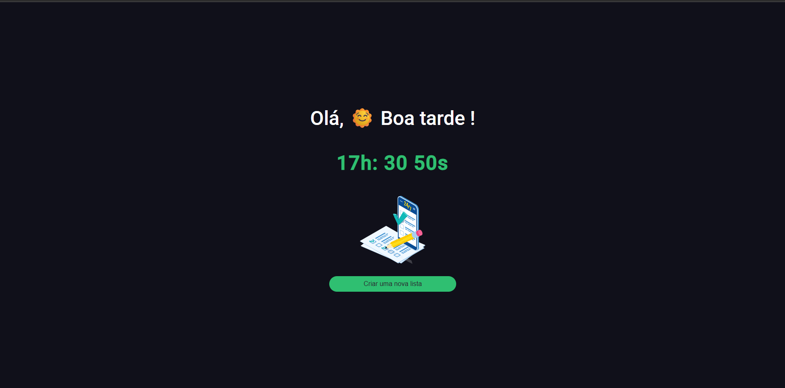
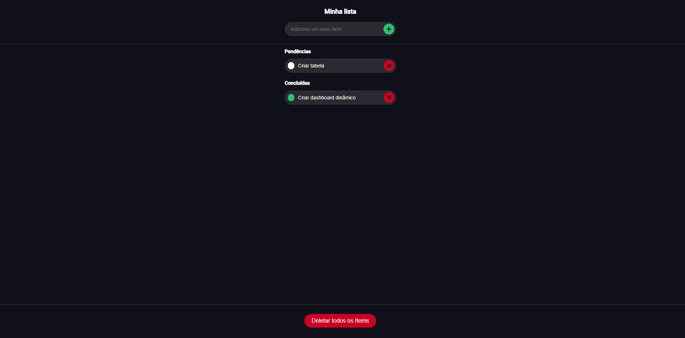

<h1 align="center">Projeto - Angular : To-do list</h1>

<p align="center">
  

  

  
  
  <a href="https://github.com/JeanGomes01/angular-todo-list/commits/master">
    
  </a>
    
   <a href="https://github.com/JeanGomes01/angular-todo-list/stargazers">
    
  </a>
</p>

<p align="center">Vamos construir uma to-do list em Angular, utilizando localStorage para persistência das tarefas. </p>

<p align="center">

</p>

## 🥶 Sobre o projeto

Desenvolvi esse projeto para reforçar meu conhecimento em Angular e TypeScript principalmente com CRUD armazenando informações no Local Storage do browser.

## 🚀 Tecnologias

Principais tecnologias que utilizei para desenvolver esta aplicação

- [TypeScript](https://www.typescriptlang.org/) - v5.9.2
- [Angular](https://angular.dev/overview) - v20.3.0
- [Angular CLI](https://angular.dev/tools/cli) - v20.3.4
- [RxJS](https://rxjs.dev/) - v7.8.0
- [SweetAlert2](https://sweetalert2.github.io/) - v11.26.3
- [SCSS](https://sass-lang.com/) - Para estilização
- [Karma](https://karma-runner.github.io/) - Para testes

## Guia de inicialização

Para instalar e configurar uma cópia local, siga estas etapas simples:

### Pré-requisitos

Para garantir o funcionamento adequado da nossa aplicação, verifique abaixo:

1. **Node.js** (versão 18 ou superior)
2. **npm** (geralmente vem com o Node.js)

### Instalação

1. **Clone o repositório**:

```sh
git clone https://github.com/JeanGomes01/angular-todo-list
```

2. **Navegue na raiz do projeto angular-todo-list:**

```sh
cd angular-todo-list
```

3. **Instale os módulos:**

```sh
npm install
```

4. **Rode o aplicativo:**

```sh
ng serve
```

5. **Acesse no navegador:**

Abra [http://localhost:4200](http://localhost:4200) para visualizar a aplicação.

## Roadmap

- [x] Iniciar a aplicação Web
- [x] Conseguir criar tarefas
- [x] Conseguir editar tarefas
- [x] Conseguir deletar ou excluir tarefas
- [x] Conseguir deletar todas as tarefas de uma única vez
- [x] Manter armazenado as tarefas no Storage Local
- [x] Implementar interface responsiva
- [x] Adicionar validações de formulário
- [x] Implementar notificações com SweetAlert2

## 🎨 UI/UX

Interface desenvolvida com foco na experiência do usuário, utilizando SCSS para estilização e componentes modulares.

|             Tela de inicial             |               Tela de tarefas                |
| :-------------------------------------: | :------------------------------------------: |
|  |  |

## 📁 Estrutura do Projeto

```
src/
├── app/
│   ├── modules/
│   │   └── to-do-list/
│   │       ├── components/
│   │       │   ├── input-add-item/
│   │       │   ├── input-list-item/
│   │       │   └── time-title/
│   │       ├── enum/
│   │       ├── interface/
│   │       └── pages/
│   │           └── list/
│   ├── app.config.ts
│   ├── app.routes.ts
│   └── app.ts
├── assets/
│   ├── icons/
│   └── img/
└── scss/
    ├── base/
    ├── component/
    ├── layout/
    └── theme/
```

## 🚀 Scripts Disponíveis

- `ng serve` - Inicia o servidor de desenvolvimento
- `ng build` - Compila o projeto para produção
- `ng test` - Executa os testes unitários
- `ng generate component nome-do-componente` - Gera um novo componente

## 📝 Funcionalidades

- ✅ **Criar tarefas** - Adicione novas tarefas à sua lista
- ✏️ **Editar tarefas** - Modifique tarefas existentes
- 🗑️ **Deletar tarefas** - Remova tarefas individuais
- 🧹 **Limpar todas** - Remova todas as tarefas de uma vez
- 💾 **Persistência** - Dados salvos no localStorage do navegador
- 📱 **Responsivo** - Interface adaptada para diferentes tamanhos de tela
- 🎨 **Interface moderna** - Design limpo e intuitivo
